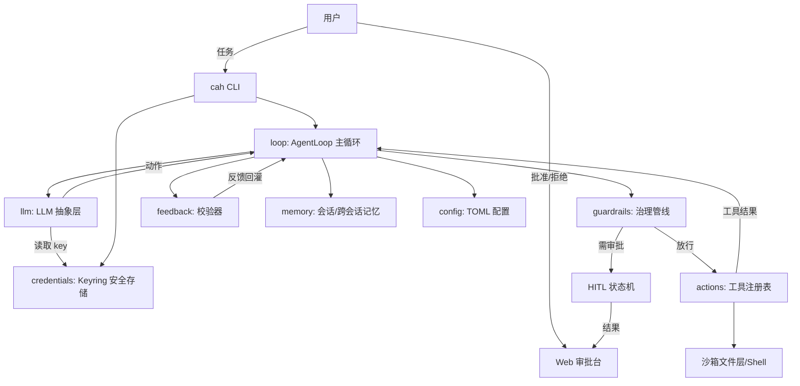

# SPEC — Coding Agent Harness (`cah`)

> 课程：AI4SE 期末项目 · A · Coding Agent Harness（首选）
> 完整要求 = 《通用要求》 + 《A · Coding Agent Harness》
> 本文档是 brainstorming 的产物：逐节与用户确认后落稿，作为实现阶段的唯一规约依据。
> 日期：2026-08-10

---

## 1. 问题陈述

LLM 擅长"决定下一步做什么"，但它本身不是一台可依赖的系统：它可能输出非法动作、执行危险命令、在失败后原地打转、遗忘上下文。本项目的核心问题是如何用**工程手段**把只会产生"下一步设想"的 LLM 封装成一台稳定、可靠、可治理地完成编码任务的机器——即 harness。

目标用户：需要在受控环境中让 AI 自主完成编码任务（读写文件、跑命令、跑测试），同时必须保证安全边界、过程可审计、行为可解释的个人开发者。本课程语境下即学习者本人。

为什么值得做：当 LLM 完成大部分"思考"后，工程师的价值集中在 harness 层——主循环、治理护栏、客观反馈、上下文组织、凭据与分发。本项目用第一手实现回答："让一个不可靠的决策器可靠地工作，到底需要哪些工程？"并将"治理"作为主要贡献做深。

## 2. 用户故事

1. **自主完成编码任务**：作为开发者，我给 harness 一个编码任务（如"实现一个函数并补测试"），它能自主读写工作区、执行命令、运行测试，直到任务完成或达到步数上限。验收：mock LLM 脚本下，循环在有限步内停机，产物落盘。
2. **危险动作拦截与人工审批**：作为开发者，当 agent 要执行危险动作（如 `rm -rf`、`git push`、`DROP DATABASE`）时，我可以批准或拒绝，以便在危险操作真正执行前有机会人工干预；拒绝后 agent 收到原因并调整下一步。验收：护栏确定性拦截；HITL 状态机全转移路径单测通过。
3. **浏览器远程审批**：作为开发者，我可以在浏览器里实时查看运行事件，并远程批准/拒绝待审动作。验收：demo 实例在 mock 模式下可完成一次含审批的完整循环。
4. **声明式配置**：作为开发者，我用 TOML 文件声明护栏规则、审批策略、启用的工具，无需改代码。验收：改配置后行为随之变化；非法配置快速失败并给出明确错误。
5. **客观反馈与自我修正**：作为开发者，当测试失败时，agent 收到确定性的失败分类信号并基于它修正（有限重试）。验收：机制演示第②条——注入一次失败，下一次动作改变。
6. **跨会话记忆**：作为开发者，agent 能跨会话记住项目约定与历史决策，并按需召回而非全量载入。验收：同一工作区两次运行，第二次能通过 `memory_recall` 取到约定。
7. **离线确定性可测**：作为开发者，我可以在不联网、不花钱的情况下用 mock LLM 确定性复现 harness 的每个核心机制。验收：全部核心机制单测不依赖网络与真实 LLM。
8. **凭据安全**：作为开发者，我可以安全录入、查看状态（不回显）、更新、清除 API key。验收：key 永不落盘明文、永不进 git、日志脱敏。

## 3. 功能规约

### 3.1 `llm/` — LLM 抽象层

- 输入：`context: list[Message]`、可用的动作定义、配置。
- 行为：`LLMClient.complete(...)` 返回结构化 `LLMResponse`（含最终文本与可选 `Action`）。
- 输出：`LLMResponse(text, action, done: bool)`。
- 实现：
  - `MockLLM`：从脚本化 JSONL 按步读取确定性响应；支持"注入失败"场景（脚本可指定某步返回失败信号）。离线测试与演示主力。
  - `DeepSeekLLM`：httpx 调用 OpenAI 兼容 `/chat/completions`（或 responses 风格），key 来自凭据模块，绝不明文落盘。
- 边界：上下文长度超限时截断并告警；超时按失败处理（结构化错误，不崩溃）。
- 错误处理：网络失败/认证失败 → 结构化 `LLMError`，循环按可重试策略处理，重试有界。

### 3.2 `loop/` — 主循环

- 输入：任务文本、工作区路径、配置。
- 行为：组装上下文（任务 + 记忆召回 + 历史反馈 + 配置摘要）→ 调 LLM → 解析 `Action` → 护栏 → 分发工具 → 反馈 → 追加上下文 → 停机判断。
- 输出：`RunResult(status, actions_log, final_output)`；运行事件流（JSON Lines + Web SSE）。
- 边界：`max_steps`（默认 10）硬上限；单工具超时（默认 120s）；循环必然终止。
- 停机条件（满足其一）：LLM 输出 done 且校验器通过 / 达 `max_steps` / 用户中止。
- 错误处理：LLM 输出不可解析 → 回灌"格式错误"并重试（有界）；工具失败 → 结构化回灌；护栏拒绝 → 结构化回灌，agent 可调整策略。

### 3.3 `actions/` — 工具与分发

- 输入：`Action(type, params)`。
- 行为：`ToolRegistry` 按名称分发到工具函数，工具在工作区边界内执行。
- 内置工具：`read_file`、`write_file`、`list_dir`、`search`（rg）、`shell`、`run_tests`、`memory_store`、`memory_recall`。
- 输出：统一 `ToolResult(ok, output, meta)`。
- 边界：所有文件写入经沙箱文件层（路径围栏）；shell 有超时与输出上限；`--read-only` 模式下禁用写类工具。
- 错误处理：工具内部错误转成 `ToolResult(ok=False, output=错误信息)`，不抛出到循环。

### 3.4 `guardrails/` — 治理（重点维度）

- 输入：`Action` + 工作区上下文。
- 行为：`GuardrailPipeline` 顺序执行检查链，返回 `SAFE | REQUIRE_APPROVAL | BLOCKED`（含原因与风险等级）。
- 检查器：
  - `CommandGuardrail`：shell 命令 token 化后匹配黑名单（`rm -rf`、`DROP DATABASE`、`git push`、`curl|sh`、`sudo`、`chmod 777`、格式化磁盘等）与白名单前缀（如 `python -m pytest`）。
  - `PathGuardrail`：realpath + 符号链接解引用，越出工作区根目录一律拦截。
  - `ToolGuardrail`：按配置允许/禁用工具，只读模式强制。
- 输出：`GuardrailDecision(verdict, reason, risk_level, action_id)`。
- 边界：fail-closed——规则自身出错时按 BLOCKED 处理。
- 错误处理：未知命令解析歧义 → 保守拦截或转人工。
- 与 HITL 的衔接：`REQUIRE_APPROVAL` 结果转交 `hitl/` 模块（见 3.5）。

### 3.5 `hitl/` — HITL 审批状态机（独立模块）

- 输入：`approve(action_id, token)` / `reject(action_id, token)` / 超时事件。
- 状态：`PENDING → APPROVED | REJECTED | EXPIRED | CANCELED`。
- 行为：
  - 每个待审动作生成唯一 `action_id` 与一次性审批 token；
  - 审批持久化到 `<workspace>/.harness/approvals.json`，CLI 与 Web 均可操作；
  - 重复审批幂等（第二次返回已处理状态）；token 不匹配拒绝操作；
  - 超时（默认 300s，可配置）→ `EXPIRED`，按拒绝处理（fail-safe）。
- 输出：审批结果写回运行事件流，回灌给 LLM（"动作被拒绝：原因"）。
- 边界：未初始化工作区或动作不存在 → 明确错误；并发审批由文件锁/单写者保证。

### 3.6 `feedback/` — 反馈闭环

- 输入：校验器配置 + 工作区产物。
- 行为：`Validator.validate(workspace) -> Feedback(ok, failures[], summary)`。
- 内置：`TestRunnerValidator`（执行配置的测试命令，解析退出码与输出 → 失败分类）；`LintValidator` 可选。
- 输出：`Feedback` 结构化回灌到上下文；循环带 `max_retries`（默认 3）自动重试。
- 边界：测试命令超时/未配置 → 明确反馈；反馈内容有长度上限。

### 3.7 `memory/` — 记忆

- 输入：`memory_store(key, content, tags)` / `memory_recall(query)`。
- 行为：会话记忆保存运行内事件流；跨会话存储写入 `<workspace>/.harness/memory.json`，按关键词/标签检索。
- 输出：召回片段列表（不携带无关记忆）。
- 边界：条目数/单条长度上限；损坏文件 → 备份后重建并告警。

### 3.8 `config/` — 声明式配置

- 输入：TOML 文件（默认 `harness.toml`）。
- 行为：加载并校验（模型、`max_steps`、审批策略、护栏黑/白名单、工具开关、校验器、记忆开关）；`cah config init` 生成模板。
- 输出：`HarnessConfig` 数据类；校验失败 → 快速失败并列出错误位置。
- 边界：未知键告警不致命；危险值（如禁用全部护栏）要求显式确认。

### 3.9 `cli/` — 命令行入口

- `cah run "<task>"`：本地运行 agent（`--mock` 强制 mock、`--read-only` 只读沙箱）。
- `cah approve <id>` / `cah reject <id>`：终端审批。
- `cah status`：运行与待审动作概览。
- `cah key set/status/clear`：凭据管理。
- `cah config init/show`：配置管理。
- `cah demo`：运行机制演示。
- 边界：非交互环境下审批命令要求显式参数；所有命令退出码 0=成功、非 0=失败（测试友好）。

### 3.10 `web/` — 审批台与演示

- 页面：单页原生 HTML/JS（无构建步骤）。
- API：`GET /`（UI）、`GET /api/actions`（待审列表）、`POST /api/actions/{id}/approve|reject`、`GET /api/runs/{id}/events`（SSE）、`POST /api/demo`（启动演示运行）。
- 模式：`HARNESS_DEMO=1` 时强制 MockLLM + 只读沙箱；公网实例仅运行 demo 模式。
- 边界：demo 模式下不执行真实写操作；事件流带心跳与断线重连。

## 4. 非功能性需求

### 4.1 性能
- mock 模式单轮循环 < 1s；真实 LLM 单轮受网络延迟约束。
- 循环必然终止：`max_steps` 硬上限 + 单工具超时 + 总运行超时。

### 4.2 安全（含凭据威胁模型）
- 凭据威胁模型：攻击面 = 源码仓库、日志、终端历史、明文配置文件、进程环境、CI 配置。
  - key 绝不硬编码进源码、绝不进 git（含历史）、绝不写入日志/终端历史；
  - 主存储：OS 凭据管理器（Windows Credential Manager，经 `keyring`）；
  - 兜底：`.env` 文件（明文，风险明示于文档与首次运行提示）；
  - 进程环境可见性风险在 README 中说明；
  - 日志脱敏：任何输出前对 key 做掩码。
- 沙箱边界：路径围栏、命令黑/白名单、只读模式、环境变量净化、输出截断。
- fail-closed：护栏或配置出错时拒绝执行。

### 4.3 可用性
- 首次运行引导录入 key（隐藏输入）；配置模板一键生成；错误信息含上下文与修复建议。
- 文档：README 覆盖安装、运行、key 配置、分发、已知限制。

### 4.4 可观测性
- 运行事件流（JSON Lines 落盘 + Web SSE）；审批动作全量审计（谁、何时、结果）。
- `cah status` 提供运行概览；测试与 CI 输出可读。

## 5. 系统架构

数据流：任务 → 主循环 → LLM → `Action` → 护栏（可能转 HITL 审批）→ 工具执行 → 校验器 → 反馈回灌 → 循环 → 停机。

外部依赖：DeepSeek（OpenAI 兼容 API，真实模式）、keyring（Windows Credential Manager）、pytest（校验器默认测试命令）、Render（线上 demo 实例）。

## 6. 数据模型

| 实体 | 字段 | 约束 |
| --- | --- | --- |
| `Run` | `id, task, status, steps, started_at, ended_at` | `steps <= max_steps`；状态机：`running → done/failed/aborted` |
| `Action` | `id, run_id, type, params, created_at` | 每个 action 唯一 id |
| `Approval` | `action_id, state, token_hash, decided_by, decided_at` | 状态 ∈ `PENDING/APPROVED/REJECTED/EXPIRED/CANCELED`；单 action 单审批记录 |
| `MemoryEntry` | `key, content, tags[], created_at` | 跨会话持久化于 `.harness/memory.json` |
| `Feedback` | `ok, failures[], summary` | 每次校验一条 |
| `HarnessConfig` | 见 §3.8 | 加载即校验 |
| `Credential` | `provider, masked_value, updated_at` | 明文只存于 OS 凭据管理器；绝不入库 |

## 7. 凭据与分发设计

### 7.1 凭据
- 存储方案：`keyring`（Windows Credential Manager）为主；`.env` 为明示风险的兜底；环境变量为只读来源之一。
- 首次运行：`cah key set` 隐藏输入引导录入；`cah key status` 只显示掩码状态；`cah key clear` 清除。
- 威胁模型：见 §4.2；CI 中 key 经平台 secrets 注入，测试默认全部走 mock。

### 7.2 分发
- 形态：PyPI 包（`pyproject.toml` + `python -m build` 产出 wheel）。
- 目标平台：Python 3.11–3.14，跨平台（Windows/macOS/Linux）。
- 获取方式：`pip install cah`（发布后）或 `pip install git+https://github.com/<owner>/coding-agent-harness.git`。
- key 配置：目标机执行 `cah key set`（推荐，走凭据管理器）或 `.env`（明示明文风险）。
- 已知限制：真实 LLM 需要网络与有效 key；免费部署实例为 demo 模式（MockLLM + 只读）。

## 8. 技术选型与理由

| 项 | 选择 | 理由 |
| --- | --- | --- |
| 语言 | Python 3.11–3.14（CI 固定 3.12 作稳定基线） | mock 抽象与确定性测试最友好；3.14 已由冷启动验证实测可用（见 §10），CI 固定 3.12 保证干净机可复现 |
| HTTP | httpx | 轻量、支持 OpenAI 兼容 API |
| Web | FastAPI + uvicorn | SSE 支持好、零前端构建的演示审批台 |
| 凭据 | keyring | 跨平台 OS 凭据管理器封装 |
| 测试 | pytest | 事实标准；一键 `python -m pytest` |
| 打包 | hatchling | 轻量现代打包 |
| LLM | DeepSeek（OpenAI 兼容）+ Mock | 已有可用 key；mock 保证离线可测 |
| 部署 | Render 免费 Web Service | 从 GitHub 自动部署；满足"线上可访问 WebUI" |
| 分发 | PyPI | 无需 Docker；安装命令简单 |

## 9. 验收标准

1. `python -m pytest` 一键通过；全部核心机制测试使用 MockLLM，离线可跑。
2. `demo/mechanism_demo.py` 确定性复现：① 护栏拦截危险动作；② 注入失败 → 反馈改变下一步；③ HITL 状态机全转移。
3. `cah run` 在 mock 模式下完成一次端到端运行并停机，事件流落盘。
4. 危险命令被拦截且原因回灌；审批/拒绝/超时行为符合 §3.5。
5. 跨会话记忆可写可召回；配置错误快速失败。
6. key 可录入/查看掩码状态/更新/清除；仓库与日志无真实凭据。
7. `README.md` 含课程要求的全部章节；PyPI 构建产物可安装运行。
8. 两套 CI 并存且均通过：GitHub Actions 为实际 CI（push 自动跑测试 + 构建 wheel），承载公开仓库的 PR 工作流；`.gitlab-ci.yml` 含 `unit-test` job，随仓库推送到 NJU GitLab 满足作业清单要求；两次 CI 的最后执行记录均为 pass。
9. Render demo 实例公网可访问，可完成一次含审批的演示运行。
10. 交付物齐全：`SPEC.md`、`PLAN.md`、`SPEC_PROCESS.md`、`README.md`、`AGENT_LOG.md`、`REFLECTION.md`、CI 配置。

## 10. 风险与未决问题

- Python 版本策略：本机为 3.14.2，经冷启动验证（2026-08-10）确认依赖安装与全部核心测试在 3.14 下通过，故项目支持 `>=3.11,<3.15`；CI 固定 3.12 作为稳定基线，README 写明依赖前提。
- Windows shell 语义：`shell` 工具需明确默认解释器（cmd），token 化解析需跨平台测试。
- keyring 在无桌面会话（如 CI/服务器）不可用：以 `.env`/环境变量兜底并文档化。
- Render 免费档休眠与冷启动：README 明示；演示可接受。
- 真实 LLM 输出不可控：有界重试 + fail-closed + 步数上限兜底。
- 未决：是否发布到公开 PyPI（先以 git 安装路径交付，发布作为可选增强）；Render 账号待用户注册完成；GitHub 仓库名与最终 PyPI 包名在创建仓库时确定并回填本文档。

## 11. 领域与机制设计（A.5 额外章节）

### 11.1 领域：coding
- 反馈信号：运行测试（pytest）的退出码与输出、lint/类型检查（可选）——客观、确定、可回灌。
- 危险动作：破坏性文件/磁盘命令（`rm -rf`、格式化）、数据库删除、对外发布（`git push`、部署）、提权（`sudo`）、下载即执行（`curl | sh`）、权限放宽（`chmod 777`）。
- 所需工具：读写文件、列目录、搜索、执行命令、运行测试、记忆读写。
- 记忆需求：项目约定、历史决策、失败教训——跨会话按需召回。

### 11.2 重点维度：治理，为什么
- 治理（护栏/沙箱/HITL 状态机）天然由代码构成，最契合 §A.4"机制必须是代码、移除 LLM 仍可单测"的硬标准；
- 与必交的 WebUI 结合最自然：审批台即 HITL 的人机界面；
- 三个子机制（静态规则、逻辑沙箱、审批状态机）层次清晰，足够做深而不摊薄。

### 11.3 机制如何编码实现（呼应 §A.4）
- `guardrail(action)` 是确定性函数：规则匹配、路径解析、工具策略，全部可离线单测；
- HITL 状态机是确定性状态转移代码，与 LLM 无关，可全路径单测；
- 反馈校验器解析产物 → 客观判定 → 回灌，代码实现而非提示词；
- `LLMClient` 抽象使 mock 可注入：所有核心机制测试替换为 mock/stub LLM 后仍成立；
- 提示词/规则文件仅作为"内容物"承载策略声明，机制本体一律在代码中。

### 11.4 可单测机制清单（判据：移除真实 LLM 后仍可确定性验证）

| 机制 | 测试方式 |
| --- | --- |
| 工具分发 | 构造 `Action` → 断言分发给正确工具与结果 |
| 治理拦截 | `guardrail(Action(command="rm -rf /"))` → BLOCKED |
| HITL 状态机 | 全转移路径 + 幂等 + 超时单测 |
| 反馈回灌 | 假校验器注入失败 → 断言反馈进入下一轮上下文 |
| 记忆读写 | 写 → 召回 → 断言条目与检索 |
| 停机 | mock 脚本 → 断言步数上限/成功停机 |
| 配置 | 非法 TOML → 快速失败 |
